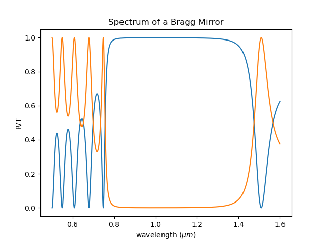
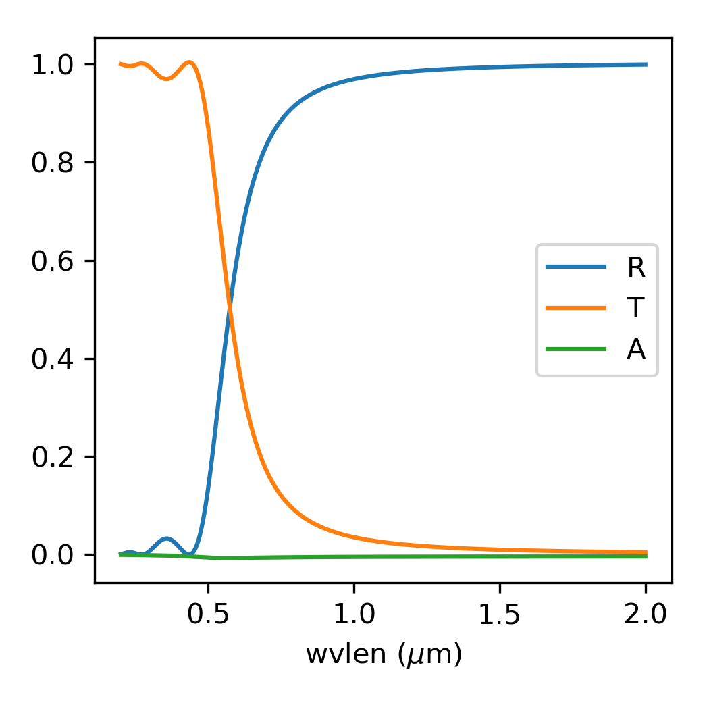
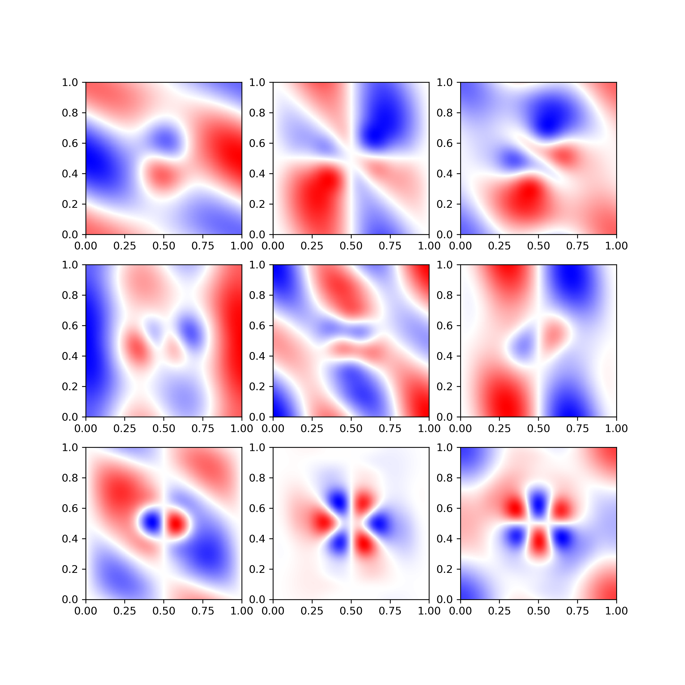
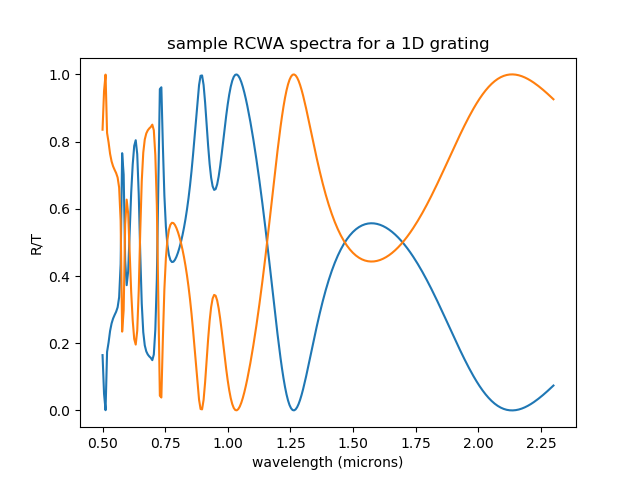

# Python Rigorous-Coupled-Wave-Analysis PACKAGE
A collection of extremely inter-related semi-analytic fourier series solutions for Maxwell's equations written in python.
This package actually contains three different methods:
1) TMM: classical transfer matrix method applicable for analyzing the propagation of light through uniform, finite thickness layers
2) Plane Wave Expansion Method: essentially solves Maxwell's equations in k-space.
3) RCWA: a synthesis of TMM and PWEM to analyze the transmission of light through layered structures with periodic patterning

The organization of the package is centered around modules which can run a simulation for each of the three methods, given the correct inputs from the user. 

The structure of much of the code, particularly the RCWA is based on EMPossible (formerly EMLab) notes (https://empossible.net/academics/emp5337/). These notes provide a good reference.

## Prerequisites and Installation
Make sure you have a functional version of python 3 with numpy, scipy, and matplotlib. (Python 3 is required because we use the @ symbol for matrix multiplication)
Simply clone the package into your local directory and you should be ready to go.

## USAGE
Right now, the package is partitioned by the type of numerical method used. Examples for each method are in the folder "method_name"_examples. These examples should give you a sense of how to use the simulation functions

# Examples
We show a few exemplary examples from each method to illustrate its functionality
## First TMM
TMM is usually the 'intellectual' precursor to RCWA. It assumes different layers but each layer has no structure (could be anisotropic however)
A simple demonstration of TMM can be done by reproducing the spectrum of a Bragg grating.

Or the Drude model

## PWEM
Plane wave expansion method is simply the solution of Maxwell's equations in Fourier space.

We benchmark the code using a photonic circle. 

Here, we demonstrate several reconstructed modes in real space below

## Transitioning to RCWA
RCWA is a synthesis of TMM and PWEM in that it targets layered structures whereby each layer contains some sort of periodic pattern
In this package, we implement RCWA to handle layers with periodicity along one direction (perpendicular to the propagation direction) or both.

References
https://www.osapublishing.org/josa/abstract.cfm?uri=josa-71-7-811

## Authors
Nathan Zhao
